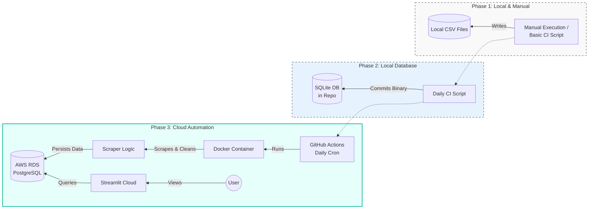

# Job Bank Trend Tracker

**A fully automated data pipeline and interactive dashboard for tracking IT job market trends in Canada.**

## Overview

This project scrapes, cleans, and visualizes job posting data from **Job Bank Canada** to provide real-time insights into the IT job market. It tracks metrics like salary trends, top cities for tech jobs, and hiring demand.

The project evolved from a simple local script to a robust, cloud-native automated pipeline.

---

## Architecture Evolution

The system architecture has undergone significant transformation to achieve automation and scalability.

### Phase 1: Local & Manual (CSV)

- **Data Storage**: Local CSV files.
- **Process**: Originally manual execution, later added basic CI scripts.
- **Limitation**: Hard to query, no historical tracking, inconsistent data structure.

### Phase 2: Local Database (SQLite)

- **Data Storage**: Migrated to **SQLite**.
- **Automation**: CI scripts ran daily but committed binary DB files to the repo.
- **Limitation**: Repository bloat due to large binary commits; database locked to single-user access.

### Phase 3: Cloud Automation (Current)

- **Data Storage**: **AWS RDS (PostgreSQL)**.
- **Automation**: **GitHub Actions** runs a Dockerized container based on the scraper logic.
- **Visualization**: **Streamlit Cloud** connects directly to AWS RDS to display real-time data.
- **Result**: A zero-touch, fully automated pipeline with scalable cloud infrastructure.

---

## Key Data Engineering Learnings

1.  **Incremental Scraping**: Implemented logic to check existing Job IDs in the database to avoid re-scraping and duplication, significantly reducing run time.
2.  **Robust Error Handling**: The Selenium scraper handles dynamic content, overlays, and connection timeouts with retry logic to ensure reliable data collection.
3.  **Containerization**: Dockerizing the application ensured that the scraping environment in GitHub Actions matches the local development environment, eliminating "it works on my machine" issues.
4.  **Cloud Migration**: Moving from SQLite to PostgreSQL on AWS RDS required handling connection strings securely and managing database migrations.

## Tech Stack

- **Language**: Python 3.12+
- **Scraping**: Selenium, BeautifulSoup4
- **Database**: PostgreSQL (AWS RDS), SQLAlchemy (ORM)
- **Dashboard**: Streamlit, Pandas
- **CI/CD**: GitHub Actions, Docker
- **Environment Management**: Docker, dotenv
